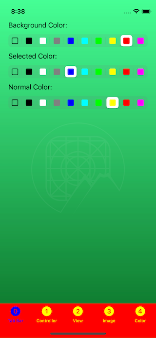
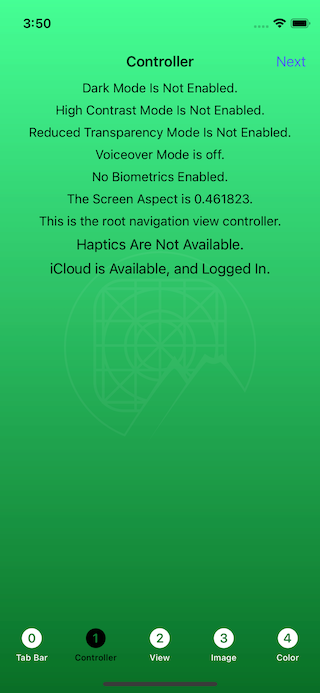
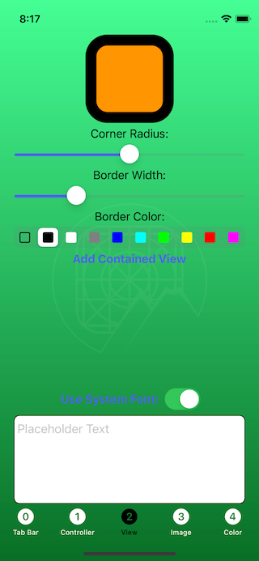
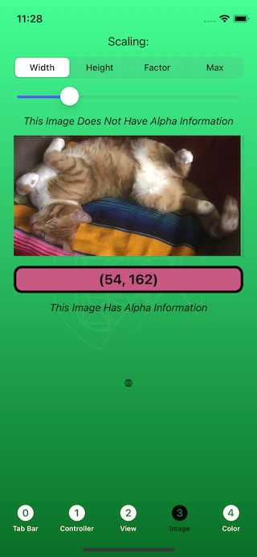
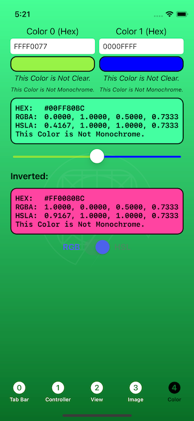
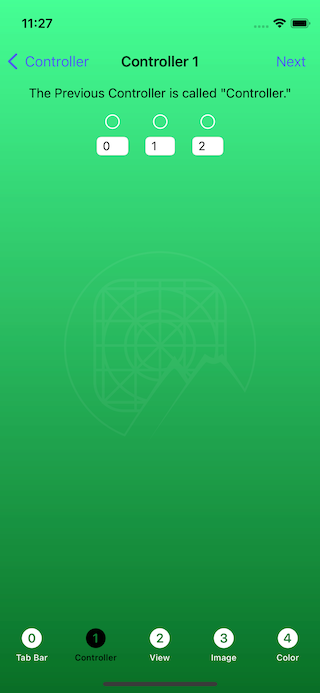

# ``RVS_UIKit_Toolbox``

A set of basic [UIKit](https://developer.apple.com/documentation/uikit) tools, for Swift iOS app development.

## Overview

This package offers a few extensions of standard UIKit classes, in order to abstract some of the more common software tasks.

## Implementation

### Where to Get

- [The project is available at this GitHub repo](https://github.com/RiftValleySoftware/RVS_UIKit_Toolbox)
- [Here is the technical documentation](https://riftvalleysoftware.github.io/RVS_UIKit_Toolbox/)

#### Swift Package Manager

The most common method of integration will almost certainly be via [the Swift Package Manager (SPM)](https://www.swift.org/package-manager/).

The package can be accessed from [GitHub](https://github.com), via the following URIs:

- SSL: `git@github.com:RiftValleySoftware/RVS_UIKit_Toolbox.git`
- HTTPS: `https://github.com/RiftValleySoftware/RVS_UIKit_Toolbox.git`

Simply integrate the package into your project, and import the module, in files that use its extensions:

    import RVS_UIKit_Toolbox

#### Carthage

You can also get the package, using [Carthage](https://github.com/Carthage/Carthage), the general-purpose package manager that is supplied by GitHub.

In order to import the package, add the following line to your [cartfile](https://github.com/Carthage/Carthage/blob/master/Documentation/Artifacts.md#cartfile):

    github "RiftValleySoftware/RVS_UIKit_Toolbox"

If you choose to build the module, you will also need to import the module into files that use the extensions:

    import RVS_UIKit_Toolbox
    
Alternatively, the entire set of extensions is available in [a single source file](https://github.com/RiftValleySoftware/RVS_UIKit_Toolbox/blob/master/Sources/RVS_UIKit_Toolbox/RVS_UIKit_Toolbox.swift), that you can integrate directly into the main module:

With Carthage, this would be available in the `Carthage/Checkins/RVS_UIKit_Toolbox/Sources/RVS_UIKit_Toolbox` directory.

If you do this, then the file would be integrated directly into the main module, so you will not need to `import` the file.

#### Git Submodule

Finally, you can simply include the module into your project, using [a Git Submodule](), which is available, using the two URIs (SSL or HTTPS), referenced above, in the Swift Package Manager section.

If you do this, you should include the source file directly into your project, as outlined in the Carthage section.

### How to Use

Once the package has been added to the project, and the module is imported (or the source file is directly integrated into the main module), the extensions immediately become available in the base UIKit classes. The extensions are listed below:

#### [`UITabBarController`](https://riftvalleysoftware.github.io/RVS_UIKit_Toolbox/Extensions/UITabBarController.html)

This adds just one method to [the standard UIKit UITabBarController Class](https://developer.apple.com/documentation/uikit/uitabbarcontroller):

- [`setColorsTo(normal: UIColor?, selected: UIColor?, background: UIColor?)`](https://riftvalleysoftware.github.io/RVS_UIKit_Toolbox/Extensions/UITabBarController.html#/s:So18UITabBarControllerC17RVS_UIKit_ToolboxE11setColorsTo6normal8selected10backgroundySo7UIColorCSg_A2JtF)

The purpose of this method, is to allow an easy shortcut to customizing the colors of the Tab Bar.

#### [`UIViewController`](https://riftvalleysoftware.github.io/RVS_UIKit_Toolbox/Extensions/UIViewController.html)

This adds a number of computed properties, and one method, to deal with [Responders](https://developer.apple.com/documentation/uikit/uiresponder).

##### Class Computed Properties
These are defined as "class" properties, so you don't need an instance to use them.
- [`biometricType`](https://riftvalleysoftware.github.io/RVS_UIKit_Toolbox/Extensions/UIViewController.html#/s:So16UIViewControllerC17RVS_UIKit_ToolboxE13biometricTypeSo010LABiometryG0VvpZ)
- [`isHighContrastMode`](https://riftvalleysoftware.github.io/RVS_UIKit_Toolbox/Extensions/UIViewController.html#/s:So16UIViewControllerC17RVS_UIKit_ToolboxE18isHighContrastModeSbvpZ)
- [`isReducedTransparencyMode`](https://riftvalleysoftware.github.io/RVS_UIKit_Toolbox/Extensions/UIViewController.html#/s:So16UIViewControllerC17RVS_UIKit_ToolboxE25isReducedTransparencyModeSbvpZ)
- [`isVoiceOverRunning`](https://riftvalleysoftware.github.io/RVS_UIKit_Toolbox/Extensions/UIViewController.html#/s:So16UIViewControllerC17RVS_UIKit_ToolboxE18isVoiceOverRunningSbvpZ)

##### System State Flag Instance Computed Properties
These are instance properties, as opposed to class properties:
- [`biometricType`](https://riftvalleysoftware.github.io/RVS_UIKit_Toolbox/Extensions/UIViewController.html#/s:So16UIViewControllerC17RVS_UIKit_ToolboxE13biometricTypeSo010LABiometryG0Vvp)
- [`isHighContrastMode`](https://riftvalleysoftware.github.io/RVS_UIKit_Toolbox/Extensions/UIViewController.html#/s:So16UIViewControllerC17RVS_UIKit_ToolboxE18isHighContrastModeSbvp)
- [`isReducedTransparencyMode`](https://riftvalleysoftware.github.io/RVS_UIKit_Toolbox/Extensions/UIViewController.html#/s:So16UIViewControllerC17RVS_UIKit_ToolboxE25isReducedTransparencyModeSbvp)
- [`isVoiceOverRunning`](https://riftvalleysoftware.github.io/RVS_UIKit_Toolbox/Extensions/UIViewController.html#/s:So16UIViewControllerC17RVS_UIKit_ToolboxE18isVoiceOverRunningSbvp)

These are only available in instances (not class):
- [`isDarkMode`](https://riftvalleysoftware.github.io/RVS_UIKit_Toolbox/Extensions/UIViewController.html#/s:So16UIViewControllerC17RVS_UIKit_ToolboxE10isDarkModeSbvp)
- [`hapticsAreAvailable`](https://riftvalleysoftware.github.io/RVS_UIKit_Toolbox/Extensions/UIViewController.html#/s:So16UIViewControllerC17RVS_UIKit_ToolboxE19hapticsAreAvailableSbvp)

##### Device Instance Computed Properties
This is a property that returns the aspect of the device screen:
- [`screenAspect`](https://riftvalleysoftware.github.io/RVS_UIKit_Toolbox/Extensions/UIViewController.html#/s:So16UIViewControllerC17RVS_UIKit_ToolboxE12screenAspect12CoreGraphics7CGFloatVvp)

##### View Hierarchy Instance Computed Properties
This will return the view controller immediately "under" this one, in a navigation stack:
- [`previousViewController`](https://riftvalleysoftware.github.io/RVS_UIKit_Toolbox/Extensions/UIViewController.html#/s:So16UIViewControllerC17RVS_UIKit_ToolboxE012previousViewB0ABSgvp)

##### Responder Stuff
This recursively finds the current selected responder (or nil, if no responder):
- [`currentFirstResponder`](https://riftvalleysoftware.github.io/RVS_UIKit_Toolbox/Extensions/UIViewController.html#/s:So16UIViewControllerC17RVS_UIKit_ToolboxE21currentFirstResponderSo11UIResponderCSgvp)

This method will also end editing for the view controller:
- [`resignAllFirstResponders()`](https://riftvalleysoftware.github.io/RVS_UIKit_Toolbox/Extensions/UIViewController.html#/s:So16UIViewControllerC17RVS_UIKit_ToolboxE24resignAllFirstRespondersyyF)

#### [`UIView`](https://riftvalleysoftware.github.io/RVS_UIKit_Toolbox/Extensions/UIView.html)

##### IBInspectable Computed Instance Properties
- [`cornerRadius`](https://riftvalleysoftware.github.io/RVS_UIKit_Toolbox/Extensions/UIView.html#/c:@CM@RVS_UIKit_Toolbox@@objc(cs)UIView(py)cornerRadius)
- [`borderWidth`](https://riftvalleysoftware.github.io/RVS_UIKit_Toolbox/Extensions/UIView.html#/c:@CM@RVS_UIKit_Toolbox@@objc(cs)UIView(py)borderWidth)
- [`borderColor`](https://riftvalleysoftware.github.io/RVS_UIKit_Toolbox/Extensions/UIView.html#/c:@CM@RVS_UIKit_Toolbox@@objc(cs)UIView(py)borderColor)

##### Screen Stuff
- [`screenAspect`](https://riftvalleysoftware.github.io/RVS_UIKit_Toolbox/Extensions/UIView.html#/s:So6UIViewC17RVS_UIKit_ToolboxE12screenAspect12CoreGraphics7CGFloatVvp)

##### Responder Stuff
- [`currentFirstResponder`](https://riftvalleysoftware.github.io/RVS_UIKit_Toolbox/Extensions/UIView.html#/s:So6UIViewC17RVS_UIKit_ToolboxE21currentFirstResponderSo11UIResponderCSgvp)
- [`resignAllFirstResponders()`](https://riftvalleysoftware.github.io/RVS_UIKit_Toolbox/Extensions/UIView.html#/s:So6UIViewC17RVS_UIKit_ToolboxE24resignAllFirstRespondersyyF)

##### Auto Layout Instance Methods
- [`addContainedView(_:underThis:andGiveMeABottomHook:)`](https://riftvalleysoftware.github.io/RVS_UIKit_Toolbox/Extensions/UIView.html#/s:So6UIViewC17RVS_UIKit_ToolboxE16addContainedView_9underThis20andGiveMeABottomHookSo19NSLayoutYAxisAnchorCSgAB_AISbtF)
- [`autoLayoutAspectConstraint(aspectRatio:)`](https://riftvalleysoftware.github.io/RVS_UIKit_Toolbox/Extensions/UIView.html#/s:So6UIViewC17RVS_UIKit_ToolboxE26autoLayoutAspectConstraint11aspectRatioSo08NSLayoutH0CSg12CoreGraphics7CGFloatV_tF)

#### [`UIImage`](https://riftvalleysoftware.github.io/RVS_UIKit_Toolbox/Extensions/UIImage.html)

##### Class Functions
- [`assetOrSystemImage(name:))`](https://riftvalleysoftware.github.io/RVS_UIKit_Toolbox/Extensions/UIImage.html#/s:So7UIImageC17RVS_UIKit_ToolboxE18assetOrSystemImage4nameABSgSS_tFZ)

##### Image Composition Instance Computed Properties
- [`hasAlphaInformation`](https://riftvalleysoftware.github.io/RVS_UIKit_Toolbox/Extensions/UIImage.html#/s:So7UIImageC17RVS_UIKit_ToolboxE19hasAlphaInformationSbvp)

##### Pixel Information Instance Methods
- [`getRGBColorOfThePixel(at:)`](https://riftvalleysoftware.github.io/RVS_UIKit_Toolbox/Extensions/UIImage.html#/s:So7UIImageC17RVS_UIKit_ToolboxE21getRGBColorOfThePixel2atSo7UIColorCSgSo7CGPointV_tF)

##### Sizing Instance Methods
- [`resized(toMaximumSize:)`](https://riftvalleysoftware.github.io/RVS_UIKit_Toolbox/Extensions/UIImage.html#/s:So7UIImageC17RVS_UIKit_ToolboxE7resized13toMaximumSizeABSg12CoreGraphics7CGFloatV_tF)
- [`resized(toScaleFactor:)`](https://riftvalleysoftware.github.io/RVS_UIKit_Toolbox/Extensions/UIImage.html#/s:So7UIImageC17RVS_UIKit_ToolboxE7resized13toScaleFactorABSg12CoreGraphics7CGFloatV_tF)
- [`resized(toNewWidth:toNewHeight:)`](https://riftvalleysoftware.github.io/RVS_UIKit_Toolbox/Extensions/UIImage.html#/s:So7UIImageC17RVS_UIKit_ToolboxE7resized10toNewWidth0fG6HeightABSg12CoreGraphics7CGFloatVSg_AKtF)

#### [`UIColor`](https://riftvalleysoftware.github.io/RVS_UIKit_Toolbox/Extensions/UIColor.html)

##### Convenience Initializers
- [`init(hex:)`](https://riftvalleysoftware.github.io/RVS_UIKit_Toolbox/Extensions/UIColor.html#/s:So7UIColorC17RVS_UIKit_ToolboxE3hexABSgSS_tcfc)

##### Color Information Instance Computed Properties
- [`hexValue`](https://riftvalleysoftware.github.io/RVS_UIKit_Toolbox/Extensions/UIColor.html#/s:So7UIColorC17RVS_UIKit_ToolboxE8hexValueSSvp)
- [`isClear`](https://riftvalleysoftware.github.io/RVS_UIKit_Toolbox/Extensions/UIColor.html#/s:So7UIColorC17RVS_UIKit_ToolboxE7isClearSbvp)
- [`isMonochrome`](https://riftvalleysoftware.github.io/RVS_UIKit_Toolbox/Extensions/UIColor.html#/s:So7UIColorC17RVS_UIKit_ToolboxE12isMonochromeSbvp)
- [`rgba`](https://riftvalleysoftware.github.io/RVS_UIKit_Toolbox/Extensions/UIColor.html#/s:So7UIColorC17RVS_UIKit_ToolboxE4rgba12CoreGraphics7CGFloatV1r_AG1gAG1bAG1atvp)
- [`hsba`](https://riftvalleysoftware.github.io/RVS_UIKit_Toolbox/Extensions/UIColor.html#/s:So7UIColorC17RVS_UIKit_ToolboxE4hsba12CoreGraphics7CGFloatV1h_AG1sAG1bAG1atvp)
- [`inverted`](https://riftvalleysoftware.github.io/RVS_UIKit_Toolbox/Extensions/UIColor.html#/s:So7UIColorC17RVS_UIKit_ToolboxE8invertedABvp)

##### Color Computation Instance Methods
- [`intermediateColor(otherColor:samplePoint:isHSL:)`](https://riftvalleysoftware.github.io/RVS_UIKit_Toolbox/Extensions/UIColor.html#/s:So7UIColorC17RVS_UIKit_ToolboxE17intermediateColor05otherF011samplePoint5isHSLA2B_12CoreGraphics7CGFloatVSbtF)

## The Test Harness App

Because the package is a UIKit extension, [unit tests will be less effective than a test harness](https://littlegreenviper.com/various/testing-harness-vs-unit/). We provide a fairly comprehensive test harness app, that not only provides excellent code coverage, but also acts as a template for real-world implementation.

[Here is the source code for the test harness app](https://github.com/RiftValleySoftware/RVS_UIKit_Toolbox/tree/master/Tests/RVS_UIKit_Toolbox_TestHarness). It is one of the targets in [the Xcode workspace](https://github.com/RiftValleySoftware/RVS_UIKit_Toolbox/tree/master/RVS_UIKit_Toolbox.xcworkspace).

The app is a fairly basic "tabbed" app, that presents 5 tabs; each, corresponding to one of the extended classes:

|Figure 1: UITabBarController|Figure 2: UIViewController|Figure 3: UIView|Figure 4: UIImage|Figure 5: UIColor|
|:----:|:----:|:----:|:----:|:----:|
||||||

Tab 1 (UIViewController) also has a navigation stack, and allows you to open a second screen, showing access to the previous view controller, and the responder properties:

|Figure 6: UIViewController Navigation Screen|
|:----:|
||

The app is written as if it were a "shipped" app, and has excellent code quality, localization, and clear implementation. It should be an excellent example of use.
## LICENSE

© Copyright 2022, [The Great Rift Valley Software Company](https://riftvalleysoftware.com)

[MIT License](https://opensource.org/licenses/MIT)

Permission is hereby granted, free of charge, to any person obtaining a copy of this software and associated documentation
files (the "Software"), to deal in the Software without restriction, including without limitation the rights to use, copy,
modify, merge, publish, distribute, sublicense, and/or sell copies of the Software, and to permit persons to whom the
Software is furnished to do so, subject to the following conditions:

The above copyright notice and this permission notice shall be included in all copies or substantial portions of the Software.

THE SOFTWARE IS PROVIDED "AS IS", WITHOUT WARRANTY OF ANY KIND, EXPRESS OR IMPLIED, INCLUDING BUT NOT LIMITED TO THE WARRANTIES
OF MERCHANTABILITY, FITNESS FOR A PARTICULAR PURPOSE AND NONINFRINGEMENT.
IN NO EVENT SHALL THE AUTHORS OR COPYRIGHT HOLDERS BE LIABLE FOR ANY CLAIM, DAMAGES OR OTHER LIABILITY, WHETHER IN AN ACTION OF
CONTRACT, TORT OR OTHERWISE, ARISING FROM, OUT OF OR IN CONNECTION WITH THE SOFTWARE OR THE USE OR OTHER DEALINGS IN THE SOFTWARE.
